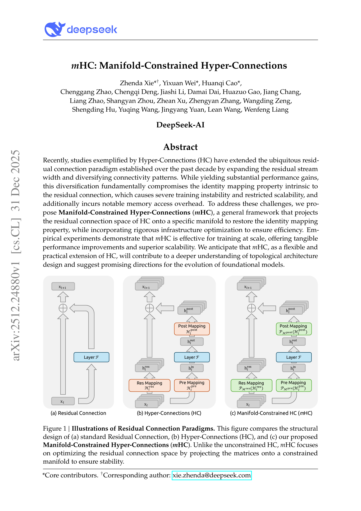
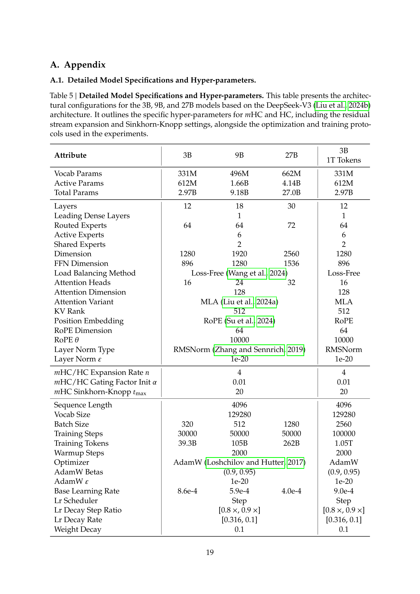
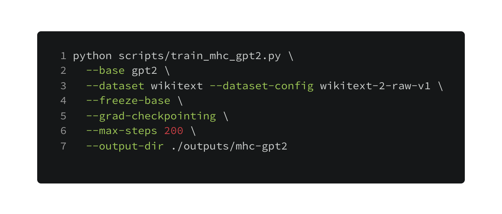
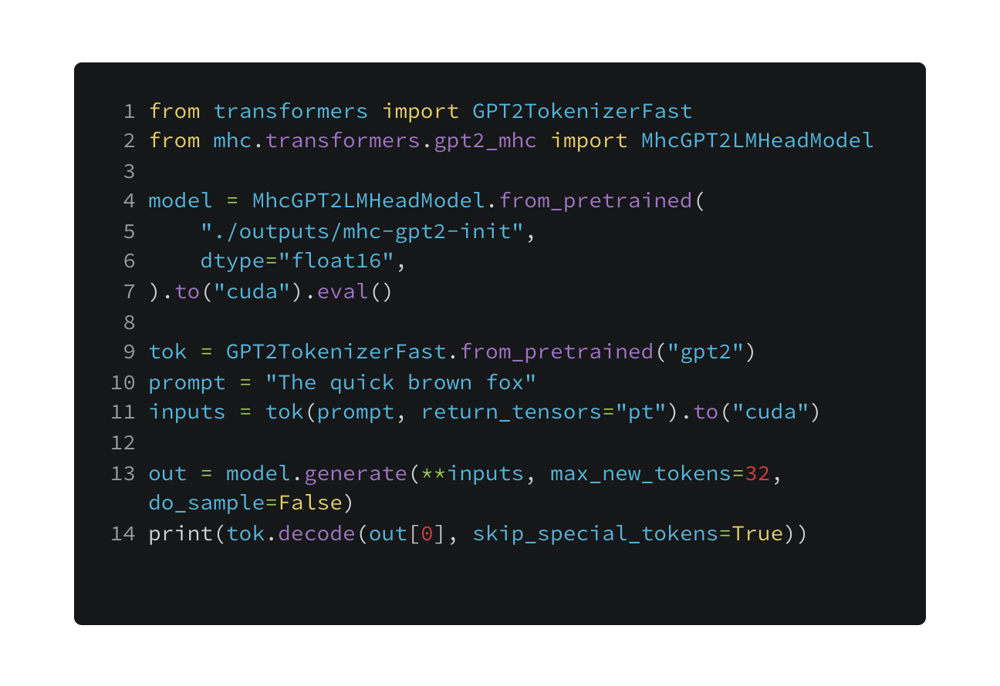

<div align="center">

## mHC: Manifold-Constrained Hyper-Connections (DeepSeek)

**PyTorch + HuggingFace implementation of mHC** (Manifold-Constrained Hyper-Connections), a residual-stream topology that restores the identity-mapping property of Hyper-Connections by projecting residual mixing matrices onto a constrained manifold (Birkhoff polytope) via Sinkhorn-Knopp.

[Paper (PDF)](2512.24880v1.pdf) · [arXiv:2512.24880v1](https://arxiv.org/abs/2512.24880v1) · [DOI:10.48550/arXiv.2512.24880](https://doi.org/10.48550/arXiv.2512.24880)


</div>

<p align="center">
  
</p>

### Why mHC?
Hyper-Connections (HC) expand the residual stream to \(n \times C\) and learn cross-stream mixing, but can break the residual identity mapping at scale. mHC stabilizes HC by projecting the residual mapping onto the **manifold of doubly-stochastic matrices** (the **Birkhoff polytope**) using **Sinkhorn-Knopp** ([paper](2512.24880v1.pdf)).

### What’s in this repo
| Area | What you get |
| --- | --- |
| **Core mHC** | Sinkhorn-Knopp projection + per-token coefficient generation (Eq. 7–9) |
| **HF integration** | `MhcGPT2LMHeadModel` (GPT-2-style decoder) with caching + `generate()` support |
| **Conversion** | Convert pretrained GPT-2 → mHC with a logits-equivalent initialization |
| **Training/Eval** | Single-device finetune + perplexity scripts (CUDA-first defaults) |
| **Qualitative compare** | One script that runs prompts on **HF mHC** and **Ollama** side-by-side |
| **Tests** | Unit + integration tests (Sinkhorn, identity init, conversion equivalence, cache/generate smoke) |

### From the paper
<p align="center">
  
</p>

<p align="center">
  
</p>

### Repository layout
- **`src/mhc/`**: Sinkhorn projection, mHC mappings, stream ops, HF model code
- **`scripts/`**: download dataset, train, eval, Ollama comparison
- **`tests/`**: unit + integration tests
- **`docs/assets/`**: images embedded in this README

---

## Quickstart (Thor / CUDA)
This system is **NVIDIA Thor** (`sm_110`) with **CUDA 13.0**. You need a CUDA-enabled PyTorch build that includes **`sm_110` kernels**.

```bash
conda create -n mhc python=3.11 -y
conda activate mhc

# CUDA-enabled PyTorch (Thor): nightly cu130 currently works on this machine
python -m pip install --pre --index-url https://download.pytorch.org/whl/nightly/cu130 torch

python -m pip install -e ".[dev]"
pytest
```

---

## Run (dataset → train → eval)
### 1) Download/cache the finetuning dataset
We default to **Wikitext-2 raw** ([dataset files](https://huggingface.co/datasets/Salesforce/wikitext/tree/main/wikitext-2-raw-v1)).

```bash
python scripts/download_dataset.py \
  --dataset wikitext --dataset-config wikitext-2-raw-v1 \
  --splits train,validation,test
```

### 2) Finetune mHC on GPT-2 (single device)
Defaults to `--device cuda` (fails fast if CUDA isn’t available). Use `--device cpu` or `--device auto` to override.

<p align="center">
  
</p>

### 3) Evaluate perplexity
```bash
python scripts/eval_perplexity.py \
  --mhc-checkpoint ./outputs/mhc-gpt2 \
  --tokenizer gpt2 \
  --dataset wikitext --dataset-config wikitext-2-raw-v1 \
  --split validation
```

---

## Convert pretrained GPT-2 → mHC (logits-equivalent init)
```bash
python -m mhc.transformers.convert_gpt2 \
  --base gpt2 --out ./outputs/mhc-gpt2-init
```

---

## Python API example
<p align="center">
  
</p>

---

## Optional: HF vs Ollama prompt comparison
Runs the same prompts through:
- **HF model**: `--hf-model ./outputs/mhc-gpt2-init`
- **Ollama**: `--ollama-model auto` picks the first installed model from `/api/tags`

```bash
python scripts/ollama_compare.py \
  --hf-model ./outputs/mhc-gpt2-init \
  --ollama-model auto \
  --max-tokens 128
```

---

## License / Attribution
This is a research implementation inspired by the paper `2512.24880v1.pdf` ([arXiv:2512.24880v1](https://arxiv.org/abs/2512.24880v1)). Dataset used in examples: [`Salesforce/wikitext` (wikitext-2-raw-v1)](https://huggingface.co/datasets/Salesforce/wikitext/tree/main/wikitext-2-raw-v1).

---

## Citation

```bibtex
@article{xie2025mhc,
  title={mHC: Manifold-Constrained Hyper-Connections},
  author={Xie, Zhenda and Wei, Yixuan and Cao, Huanqi and Zhao, Chenggang and Deng, Chengqi and Li, Jiashi and Dai, Damai and Gao, Huazuo and Chang, Jiang and Zhao, Liang and Zhou, Shangyan and Xu, Zhean and Zhang, Zhengyan and Zeng, Wangding and Hu, Shengding and Wang, Yuqing and Yuan, Jingyang and Wang, Lean and Liang, Wenfeng},
  journal={arXiv preprint arXiv:2512.24880},
  year={2025}
}
```